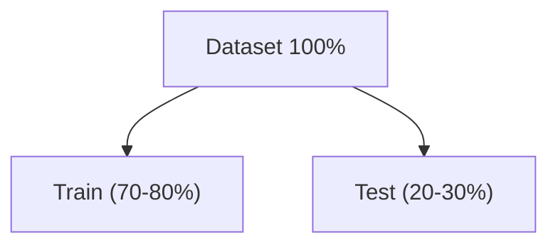

# Data Preparation

## Data Cleaning

The data cleaning is the first critical step. The raw data most of the times have issues that must be corrected.

### Common Issues

| Problem | Description | Example |
|---------|-------------|---------|
| Missing Values | Empty cells or NaN | age = NaN |
| Duplicates | Repeated rows | Same client twice |
| Typing errors | Inconsistencies in text | "Man", "man", "M"|
| Invalid values | Out of logical range | age = -5, age = 250 |
| Incorrect types | Numeric variable as text | price = "$1,234.56" |
| Extreme outliers | Outliers | income = $10,000,000,000 |
| Inconsistencies | Contradictions | age = 10, occupation = "CEO" |

## Missing Value Treatment

### Types of Missing Values

#### Missingness Types:

- **MCAR (Missing Completely At Random):**
  - Data is missing completely at random, with no underlying pattern.
  - **Example:** A sensor fails randomly.
  - **Impact:** Low, it only reduces the sample size.
- **MAR (Missing At Random):**
  - Data is missing systematically based on other observed variables.
  - **Example:** Older individuals choose not to answer income related questions.
  - **Impact:** Moderate; it can introduce bias.
- **MNAR (Missing Not At Random):**
  - Data is missing based on the unobserved value of the variable itself.
  - **Example:** Individuals with very high incomes do not report them.
  - **Impact:** High, it can introduce severe bias.

#### Treatment Strategies

| Strategy | When to Use | Pros / Cons |
| :--- | :--- | :--- |
| **Listwise Deletion (Drop rows)** | Few missing values (<5%), MCAR | `+` Simple / `-` Loss of data |
| **Feature Deletion (Drop columns)** | High missingness (>50%) in specific variables | `+` Cleans dataset / `-` Loss of information |
| **Constant Imputation** | Categorical variables | `+` Simple / `-` Creates an artificial category |
| **Mean/Median Imputation** | Numerical variables, symmetric distribution | `+` Preserves the mean / `-` Distorts (reduces) variance |
| **Mode Imputation** | Categorical variables | `+` Preserves distribution / `-` Biases towards the mode |
| **Advanced Imputation (e.g., KNN, MICE)** | Critical data, MAR | `+` Preserves feature relationships / `-` Computationally complex |

## Coding of Categorical Variables

### Types of Categorical Variables

### One-Hot Encoding

### Label Encoding

## Scaling of Numerical Variables

### Why Scaling?

### Scaling Methods

### Standarization (StandardScaler)

### Normalization (MinMaxScaler)

## Train/Test Division

The correct division in train/test is critical. It's the machanism that guarantees honest evaluation.

### Fundamental Principle

**Train/Test split**: Splitting data into two disjoint sets:

- **Train**: Used to adjust/train the model. Typically 70-80% of the data. The model learns from this data.
- **Test**: Used only for the final evaluation. Typically 20-30% of the data. The model never sees this data during the traininig. Simulates future/new data.
- **Objetive**: Estimate how well the model will generalize to new data.

### Implementation with sklearn

### Stratified Division

## Complete Pipeline Preparation
